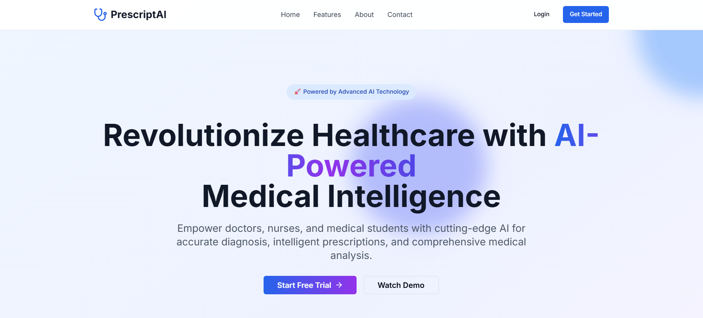

# PrescriptAI - Advanced Medical AI Platform

A comprehensive SaaS platform for healthcare professionals featuring AI-powered diagnosis, prescription generation, medical report analysis, and seamless communication with patients and pharmacies.

---

## 🖼️ Demo



---

## 🚀 Features

### 🧠 AI-Powered Medical Intelligence
- **Advanced Diagnosis**: Gemini AI analyzes patient symptoms and medical history
- **Smart Prescriptions**: Generate comprehensive prescriptions with drug interactions
- **Editable AI Responses**: Full control to review and modify AI suggestions
- **Confidence Scoring**: AI provides confidence levels for diagnostic accuracy

### 📧 Integrated Communication
- **Email Integration**: Send prescriptions directly to patients and pharmacies
- **Professional Formatting**: Beautifully formatted medical documents
- **Multi-recipient Support**: Simultaneous delivery to multiple recipients

### 🔬 Medical Report Analysis
- **Multi-format Support**: Analyze PDFs, images, and various medical documents
- **Comprehensive Interpretation**: Detailed analysis of lab results, X-rays, and reports
- **Urgency Assessment**: AI determines priority levels for medical findings
- **Clinical Recommendations**: Actionable insights and next steps

### 👥 Multi-Role Platform
- **Doctors**: Full diagnostic and prescription capabilities
- **Nurses**: Patient management and care coordination
- **Medical Students**: Learning-focused features and educational tools

### 🔒 Enterprise Security
- **HIPAA Compliance**: Full healthcare data protection
- **Encrypted Communications**: Secure data transmission
- **Role-based Access**: Granular permission controls

## 🛠️ Technology Stack

- **Frontend**: Next.js 14, React, TypeScript
- **Styling**: Tailwind CSS, shadcn/ui components
- **AI Integration**: Google Gemini 2.0 Flash API
- **Email Service**: Nodemailer with SMTP
- **PDF Generation**: jsPDF
- **File Processing**: Multi-format document analysis

## 📦 Installation

1. **Clone the repository**
   ```bash
   git clone https://github.com/AaYuSh11233/PreScriptAI.git
   cd PreScriptAI
   ```

2. **Install dependencies**
   ```bash
   npm install
   # or
   pnpm install
   ```

3. **Environment Setup**
   ```bash
   cp .env.example .env.local .env
   ```
   Update `.env` with your configuration (see example below):
   ```env
   GEMINI_API_KEY=your_gemini_api_key
   SMTP_HOST=your_smtp_host
   SMTP_PORT=587
   SMTP_USER=your_email
   SMTP_PASS=your_app_password
   NEXTAUTH_SECRET=your_secret
   NEXTAUTH_URL=https://your-domain.com
   ```

4. **Run the development server**
   ```bash
   npm run dev
   ```

5. **Open your browser**
   Navigate to `http://localhost:3000`

## 🎯 Key Workflows

### 1. AI Diagnosis & Prescription
1. **Patient Input** → Enter comprehensive patient information
2. **AI Analysis** → Gemini AI processes symptoms and medical history
3. **Review & Edit** → Healthcare professionals review and modify AI suggestions
4. **Generate Prescription** → Create professional medical prescriptions
5. **Send & Share** → Email directly to patients and pharmacies

### 2. Medical Report Analysis
1. **Upload Report** → Support for various medical document formats
2. **AI Processing** → Advanced analysis of medical findings
3. **Interpretation** → Detailed clinical significance and recommendations
4. **Action Items** → Clear next steps and follow-up instructions

### 3. Collaborative Care
1. **Multi-user Access** → Doctors, nurses, and students
2. **Shared Insights** → Collaborative decision-making
3. **Communication Hub** → Integrated messaging and notifications

## 🏗️ Project Structure

```
PreScriptAI/
├── app/                    # Next.js app directory
│   ├── api/               # API routes
│   │   ├── ai/           # AI integration endpoints
│   │   └── prescriptions/ # Prescription management
│   ├── auth/             # Authentication pages
│   ├── dashboard/        # Dashboard pages
│   └── globals.css       # Global styles
├── components/           # React components
│   ├── ui/              # UI components (shadcn/ui)
│   ├── dashboard/       # Dashboard components
│   ├── prescriptions/   # Prescription components
│   └── reports/         # Report analysis components
├── hooks/               # Custom React hooks
├── lib/                 # Utility functions
└── public/              # Static assets
```

## 🔧 API Integration

### Gemini AI Configuration
```typescript
const GEMINI_API_KEY = process.env.GEMINI_API_KEY;
const GEMINI_API_URL = "https://generativelanguage.googleapis.com/v1beta/models/gemini-2.0-flash:generateContent";
```

### Email Configuration
```typescript
const transporter = nodemailer.createTransport({
  host: process.env.SMTP_HOST,
  port: parseInt(process.env.SMTP_PORT || '587'),
  secure: false,
  auth: {
    user: process.env.SMTP_USER,
    pass: process.env.SMTP_PASS,
  },
});
```

## 🚀 Deployment

### Vercel (Recommended)
1. Push code to GitHub
2. Connect repository to Vercel
3. Add environment variables
4. Deploy with one click

### Environment Variables for Production
```env
GEMINI_API_KEY=your_gemini_api_key
SMTP_HOST=your_smtp_host
SMTP_PORT=587
SMTP_USER=your_email
SMTP_PASS=your_app_password
NEXTAUTH_SECRET=your_secret
NEXTAUTH_URL=https://your-domain.com
```

## 🔐 Security Features

- **Data Encryption**: All sensitive data encrypted in transit and at rest
- **API Security**: Rate limiting and authentication on all endpoints
- **HIPAA Compliance**: Healthcare data protection standards
- **Audit Logging**: Comprehensive activity tracking

## 📊 Analytics & Monitoring

- **Usage Analytics**: Track platform usage and performance
- **AI Accuracy Metrics**: Monitor diagnostic accuracy over time
- **User Engagement**: Dashboard analytics and insights
- **Error Monitoring**: Real-time error tracking and alerts

## 🤝 Contributing

1. Fork the repository
2. Create a feature branch (`git checkout -b feature/amazing-feature`)
3. Commit your changes (`git commit -m 'Add amazing feature'`)
4. Push to the branch (`git push origin feature/amazing-feature`)
5. Open a Pull Request

## 🔮 Roadmap

- [ ] Real-time collaboration features
- [ ] Mobile application development
- [ ] Advanced analytics dashboard
- [ ] Integration with EHR systems
- [ ] Telemedicine capabilities
- [ ] Multi-language support
- [ ] Voice-to-text prescription input
- [ ] Blockchain-based prescription verification

---

**Built with ❤️ for healthcare professionals worldwide**

*Empowering medical professionals with cutting-edge AI technology to deliver exceptional patient care.*
